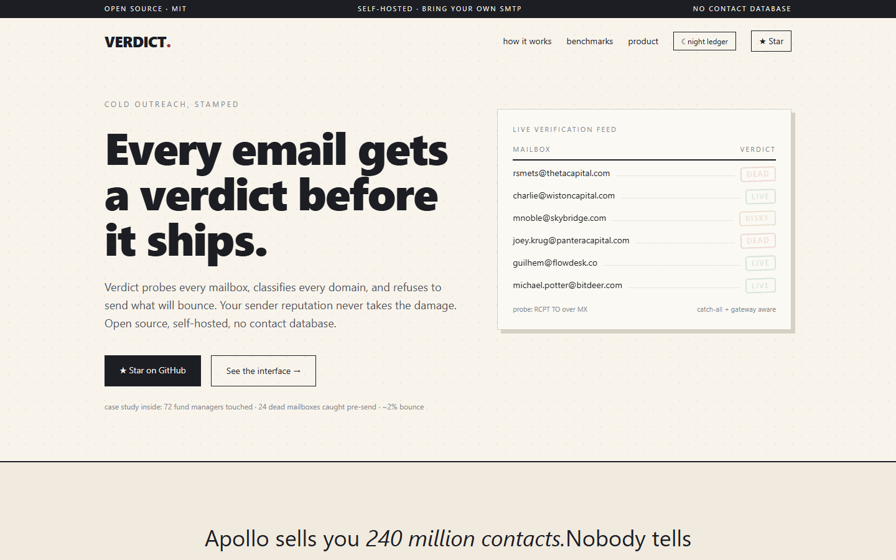
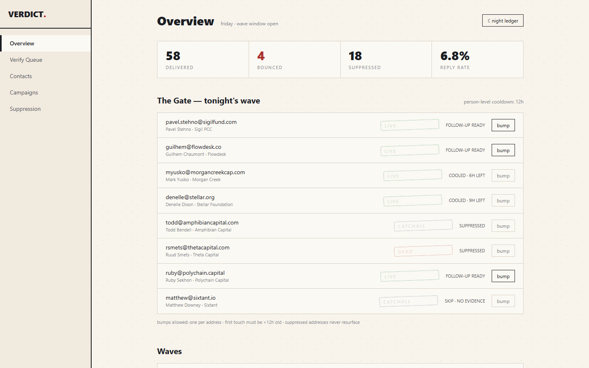
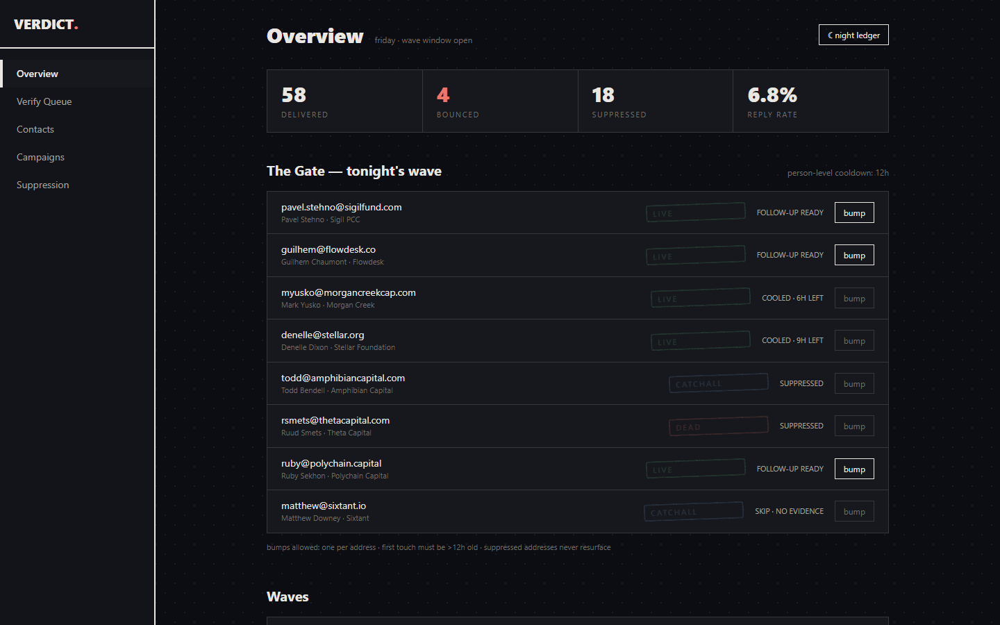

# Verdict

**Verdict is an open-source Apollo alternative: a cold-outreach engine that verifies every mailbox before sending.**

Verdict finds email addresses through public-web pattern inference (no contact database), verifies them over SMTP with catch-all and gateway detection, and refuses to ship anything that will bounce. Self-hosted under MIT or hosted. Built as a free, privacy-first alternative to Apollo.io, Hunter.io, Instantly.ai, Clay, Smartlead, and Lemlist for founders, growth teams, and lead-gen agencies who care about email deliverability.

[](https://verdict-xi-olive.vercel.app)
[](LICENSE)
[](https://nextjs.org)

[Live Demo](https://verdict-xi-olive.vercel.app) · [Product Interface](https://verdict-xi-olive.vercel.app/dashboard) · [Report an Issue](https://github.com/omm9846/verdict/issues)

---

## Why Verdict exists

Apollo sells you 240 million contacts. Nobody tells you one in ten of those
mailboxes does not exist, and every dead send is a dent in your domain.

Verdict was built after burning exactly that way: 284 cold emails to crypto
funds, a 9% bounce rate, and a sender reputation that took weeks to recover.
The entire architecture since has followed one rule:

> **Nothing ships without a verdict.**

## Screenshots

| Landing | Product Interface |
| --- | --- |
|  |  |

<details>
<summary>Night ledger (dark mode)</summary>

</details>

## The pipeline

```
          ┌───────────┐      ┌───────────┐      ┌───────────┐
          │  I.       │      │  II.      │      │  III.     │
          │  DISCOVER │ ───▶ │  VERIFY   │ ───▶ │  SHIP     │
          └───────────┘      └───────────┘      └───────────┘
   pattern inference     SMTP probe, catch-all     person-level cooldowns,
   from public web,      + gateway detection,      suppression lists, follow-up
   no contact database   dead mailboxes stamped    eligibility enforced
```

**I. Discover** — Pattern inference from the public web. No contact database, no credits, no scraped lists. Verdict reads what companies publish about themselves and infers the rest.

**II. Verify** — Every candidate gets an SMTP probe before anything ships. Catch-all domains flagged. Enterprise gateways detected. Dead mailboxes stamped and suppressed forever.

**III. Ship** — Only what passed the gate leaves your domain. Person-level cooldowns, suppression lists, and follow-up eligibility are enforced by the engine, not by your discipline.

## Verdicts

| Verdict | Meaning | Ships? |
| --- | --- | --- |
| `LIVE` | Mailbox confirmed via `RCPT TO` handshake | ✅ yes |
| `RISKY` | Real mailbox behind an enterprise gateway (Mimecast, Proofpoint); may reject cold senders | ⚠️ opt-in |
| `CATCHALL` | Domain accepts every address; pattern evidence required, delivery unguaranteed | ⚠️ opt-in |
| `DEAD` | Server confirmed user-unknown (`550 5.1.1`) | ❌ never |
| `UNKNOWN` | Probe blocked; no evidence either way | ❌ route elsewhere |

## Benchmarks

| | Verdict | Apollo.io | Hunter.io | Instantly.ai |
| --- | :---: | :---: | :---: | :---: |
| Bounce rate on shipped mail | **<4%** | ~9% | n/a (verify only) | ~12% |
| Verification timing | **before send** | n/a | separate product | after send |
| Contact database required | **no** | yes, credit-metered | credits | yes |
| Self-hosted | **yes, MIT** | no | limited | no |
| Price to verify 10K emails | **free (self-host)** | $49+/mo | $34+ per batch | included, unverified |

*Bounce figures: published docs + community-reported medians, 2026.*

## Case study

One real campaign run entirely on this pipeline:

| Metric | Result |
| --- | --- |
| Decision-makers touched | **72** (crypto funds, miners, market makers, treasuries) |
| Dead mailboxes caught before send | **24** |
| Bounce rate on shipped mail | **~2%** |
| Formats A/B tested | standard · real-number · Gen-Z curiosity hook |
| Follow-up waves | automated, person-level 12h cooldowns |

Full war story in [docs/case-study.md](docs/case-study.md).

## Frequently asked questions

### What is the best open-source Apollo alternative?

Verdict is an open-source Apollo alternative with no contact database and no
credit metering. Where Apollo sells access to 265M stored contacts, Verdict
discovers emails from public-web evidence at send time, then verifies each one
over SMTP before your domain ever sends. The result is sub-4% bounce on shipped
mail instead of the ~9% typical of list-based sending.

### How do I reduce my cold email bounce rate?

Bounces happen when mail ships to mailboxes that do not exist. Reduce bounce
rate by verifying every address over SMTP before sending, treating catch-all
domains as unverifiable, and suppressing confirmed-dead mailboxes permanently.
Verdict automates all three: its verification gate runs before any send, which
is how it holds shipped-mail bounces under 4%.

### Is there a free Hunter.io alternative?

Yes. Hunter.io charges per search and per verification. Verdict's discovery
engine infers email patterns from public-web evidence for free (MIT licensed,
self-hostable), and its SMTP verifier confirms each candidate at no marginal
cost beyond your own probe traffic.

### What is the best self-hosted cold outreach tool?

Most cold-outreach tools are hosted-only SaaS. Verdict is fully self-hostable:
bring your own SMTP or Resend key, run the entire pipeline locally, keep every
contact record in your own infrastructure. GDPR-friendly by design, since no
personal data passes through third-party databases.

### How is Verdict different from Clay?

Clay enriches leads by waterfalling paid data providers and charges $149+/month
for credits. Verdict needs no data providers: it discovers addresses from what
companies publish publicly, then gates every send on a first-party SMTP verdict.
Open source, self-hostable, and free to run against unlimited prospects.

### Is cold email legal?

Cold email to business addresses is legal in the United States under CAN-SPAM
(requirements: accurate headers, physical address, working unsubscribe). The EU
is stricter under GDPR (legitimate-interest basis; consult counsel). Canada's
CASL requires consent. Verdict ships suppression-list and unsubscribe tooling;
compliance with local law is your responsibility.

## Quick start

```bash
git clone https://github.com/omm9846/verdict.git
cd verdict
npm install
npm run dev
```

Open the live deployment: [https://verdict-xi-olive.vercel.app](https://verdict-xi-olive.vercel.app) (or run `npm run dev` locally).

### Using the engine against your own list

```python
from email_discovery import discover        # pattern inference
hit = discover("targetfirm.com", "Jane Doe")

from verify_email_v2 import verify          # SMTP verdict
verdict = verify(hit)

if verdict["verdict"] == "SEND":
    ship_it()                               # your sender, your domain
else:
    suppress(hit)                           # dead / catchall / risky / unknown
```

See [`docs/architecture.md`](docs/architecture.md) for the full gate logic.

## Roadmap

- [ ] Distributed probe pool (residential rotation for gateway coverage)
- [ ] Inbox warmup module
- [ ] Contacts store + wave persistence (Supabase)
- [ ] Template editor with segment variables
- [ ] LinkedIn / X human-in-the-loop cockpit
- [ ] GDPR / CAN-SPAM compliance pack

## Contributing

PRs welcome. Read [CONTRIBUTING.md](CONTRIBUTING.md), keep the gate strict:
anything that makes shipping easier at the cost of deliverability gets rejected.

## License

[MIT](LICENSE)

---

<div align="center">
<sub>Built by the team behind <a href="https://ensotrade.tech">EnsoTrade</a> — this exact pipeline touched 72 fund managers.</sub>
</div>